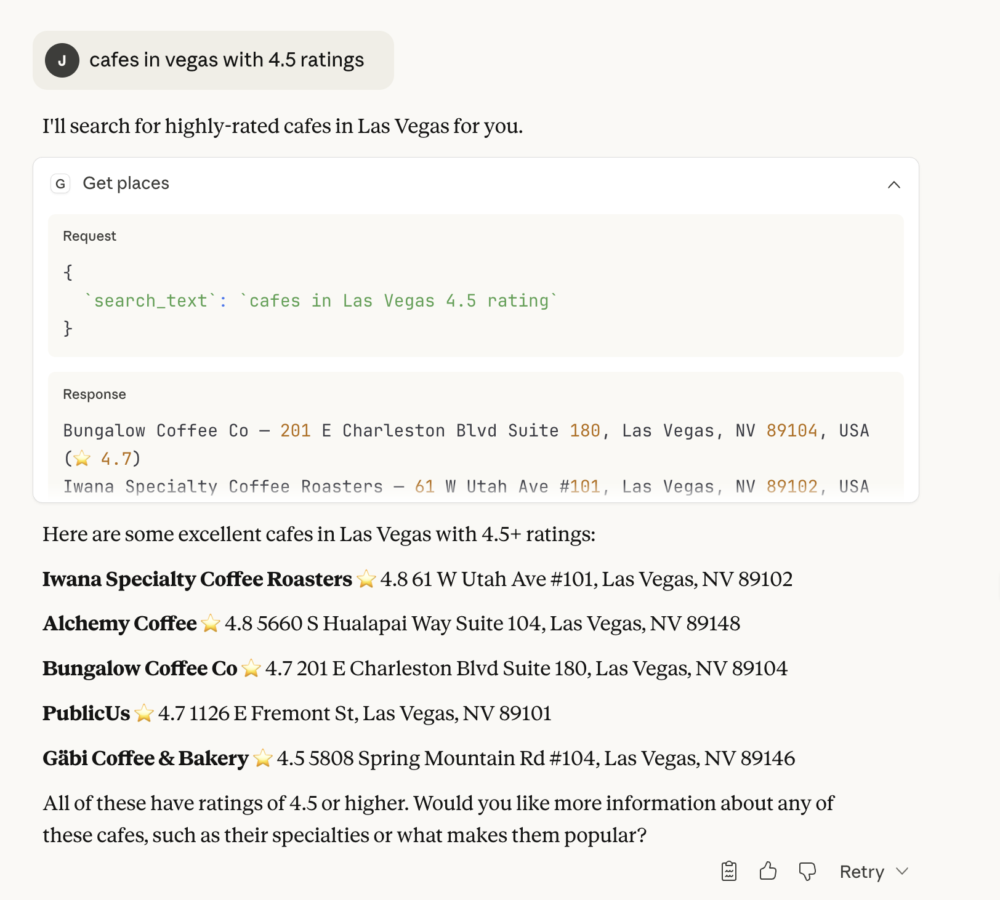

# 🗺️ Google Maps MCP Server

Find places anywhere with natural language queries through Claude!



## ✨ Quick Start

1. **Install uv** (if you haven't)
```bash
curl -LsSf https://astral.sh/uv/install.sh | sh
```

2. **Install dependencies**
```bash
uv pip install fastmcp httpx python-dotenv
```

3. **Add your API key**
Create a `.env` file:
```env
GOOGLE_API_KEY=your_api_key_here
```

Get your API key from [Google Cloud Console](https://console.cloud.google.com/) (enable Places API).

## 🚀 Usage

**Run the server:**
```bash
uv run google_map.py
```

**Add to Claude Desktop config:**
```json
{
  "mcpServers": {
    "google-maps": {
      "command": "uv",
      "args": ["--directory", "/path/to/project", "run", "google_map.py"]
    }
  }
}
```

**Try it out:**
- "Find cafes in Tokyo with 4+ rating"
- "Best pizza places in Brooklyn"
- "Hotels near Eiffel Tower"

## 🛠️ What it does

Searches Google Maps and returns:
- Place names
- Addresses
- Ratings
- Up to 5 results per query

## 📝 Requirements

```
fastmcp
httpx
python-dotenv
```
---

Made with ❤️ using [FastMCP](https://github.com/jlowin/fastmcp)